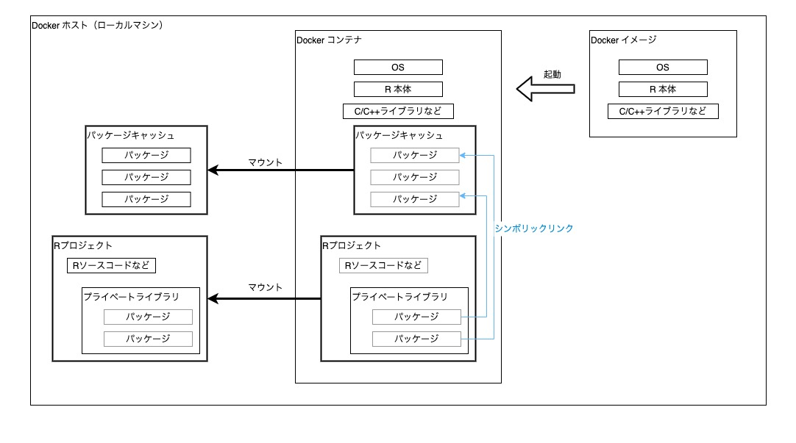

renv + Docker "外付けパッケージキャッシュパターン" の例
==================================================

renv と Docker との相互運用パターンの一例。

- ローカルマシンの Docker Desktop 上で、コンテナを使って RStudio Server を起動する。
- Docker ホスト上（つまり PC 上の普通のフォルダ）に renv パッケージキャッシュを作成し、それを Docker コンテナにマウントして利用する。

---

## 前提条件

- [Docker Desktop](https://www.docker.com/products/docker-desktop) for Windows/Mac
    - Docker 18.06 以上

---

## 初期設定

1. `.env.example` ファイルを `.env` にコピーする
2. `.env` を編集して `RENV_PATHS_CACHE_HOST` の値を正しいパッケージキャッシュのディレクトリパスに修正する（macOS の場合、`/Users/ユーザー名/Library/Application Support/renv/cache` が標準的なパス）
3. もしまだなければ、`RENV_PATHS_CACHE_HOST` の場所にディレクトリを作成する

---

## 使い方

1. 次のコマンドで RStudio Server を開始する:
    ```sh
    docker-compose up -d
    ```
2. ブラウザで <http://localhost:8787> を開き RStudio Server に接続する。
3. RStudio Server 上でプロジェクト `/home/rstudio/project/project.Rproj` を開く。
4. RStudio Server 上でソースの編集やコードの実行を行う。
5. 終了するときは次のコマンドで RStudio Server を停止する:
    ```sh
    docker-compose down
    ```

---

## 構成

### Docker イメージ

- イメージ名: `renv-docker-example:latest`
- ディレクトリ [`_rstudio/`](./_rstudio/) でビルドする。
- ベースイメージ `rocker/rstudio:4.0.2` に日本語フォントのインストールなどの修正を少し加える。
- **パッケージはコンテナ起動後に外からマウントするので、イメージのビルド時にはインストールしない。**

### コンテナ起動時のボリューム設定

- R プロジェクト
    - この Git リポジトリ全体が１つの R プロジェクトになっている。
    - このディレクトリが Docker コンテナ側の `/home/rstudio/project` にマウントされる。
- renv パッケージキャッシュ
    - Docker ホスト側（つまりローカルマシン上）の適当なディレクトリを renv パッケージキャッシュとする（macOS の場合、`/Users/ユーザー名/Library/Application Support/renv/cache` が標準的なパス）。
    - `.env` ファイルで環境変数 `RENV_PATHS_CACHE_HOST` に Docker ホスト側の renv パッケージキャッシュのパスを指定する。
    - Docker ホスト側のパッケージキャッシュがコンテナ側のパッケージキャッシュ `/home/rstudio/.local/share/renv/cache` にマウントされる。

---

## パッケージキャッシュの構造

Docker ホスト側/コンテナ側のパッケージキャッシュとプライベートライブラリは次のような関係となる:

- renv でインストールされたパッケージの実体は Docker ホスト側のパッケージキャッシュに保存される。
- Docker ホスト側のパッケージキャッシュは、ボリュームのマウントによって Docker コンテナ内のパッケージキャッシュに共有される。
- Docker コンテナ内で、プライベートライブラリ `renv/library` からパッケージキャッシュへのシンボリックリンクが作成される。



---

## 参考

* [Using renv with Docker • renv](https://rstudio.github.io/renv/articles/docker.html)
* [renv と Docker の相互運用パターン - terashim.com](https://terashim.com/posts/renv-docker-patterns/)
* [terashim/rstudio-docker-project-template](https://github.com/terashim/rstudio-docker-project-template)
